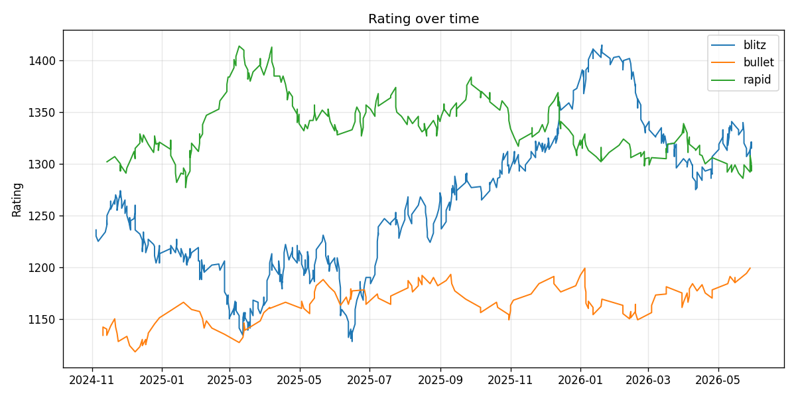
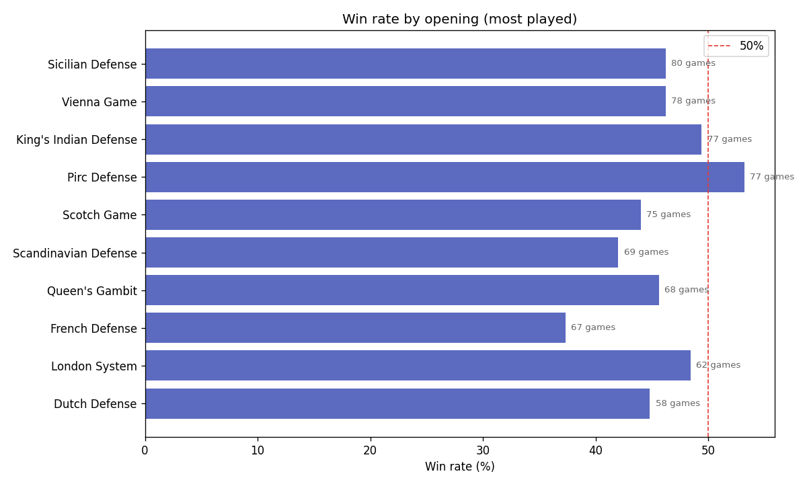

# chess-insights

I've played chess competitively since my bachelor's (represented my university at
national level in India), and I play way too much blitz online. At some point I
wanted actual numbers instead of feelings: which openings do I actually score
with? Do I really play worse after midnight? Am I tilting?

So I built this. It pulls your games from the Lichess API and runs a proper
analysis with Pandas + Matplotlib.

## What it tells you

- Rating progression over time, split by time control
- Win rate by opening (only openings with 10+ games, no small-sample noise)
- Win rate by color and by time control
- What hours you play at
- A "tilt check": your loss rate right after a loss vs. right after a win.
  Mine was 6 points worse after a loss. The data politely suggests taking breaks.

## Quick start

```
pip install -r requirements.txt
python run_analysis.py data/sample_games.csv
```

A sample dataset (991 games) is included so you can try it without an account.
Charts land in `charts/`.

To analyse your own games:

```
python src/fetch_games.py your_lichess_username 1000
python run_analysis.py data/my_games.csv
```

No API token needed for public games.

## Example output




## Stack

Python, Pandas, Matplotlib, Requests. Data comes from the
[Lichess API](https://lichess.org/api) as NDJSON.

## Things I want to add

- Compare performance home (rated) vs. casual games
- Average centipawn loss per opening (needs the analysed games endpoint)
- Chess.com support, their API format is different though

## Note

`data/sample_games.csv` is a generated demo dataset so the repo works
standalone. Plug in your own username for real numbers.
